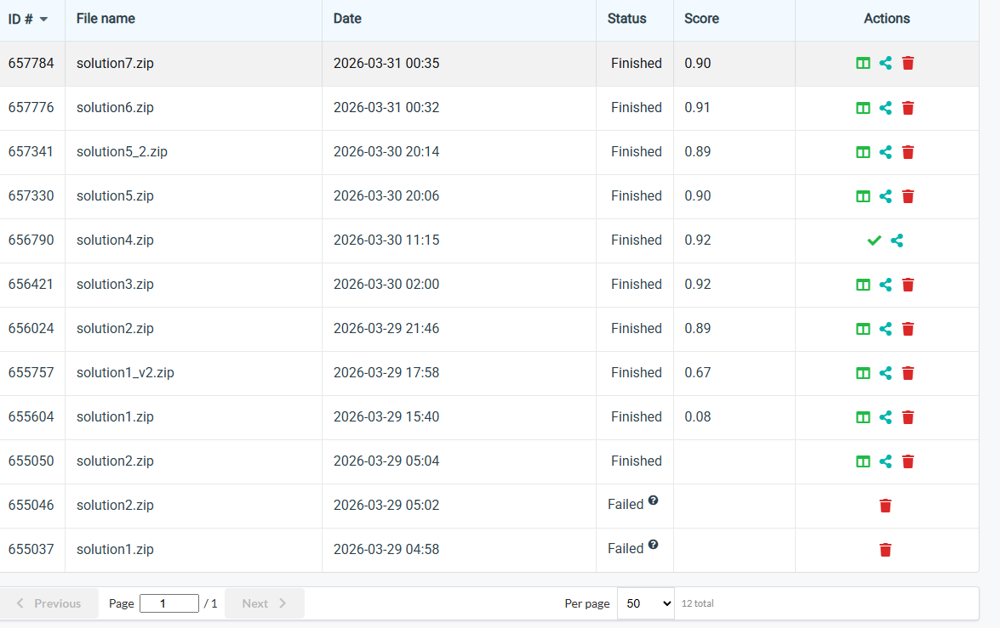

Markdown
# NYCU Computer Vision 2026 HW1
* Student ID: 111550028
* Name: 黃柏翔
## Introduction
In this homework, I utilized the ResNet architecture as the backbone to build an image classifier. To further enhance the model's performance, I implemented a series of advanced techniques throughout the project. These include robust data augmentation, data normalization, progressive fine-tuning, and mixed-precision training for computational efficiency. Finally, I explored advanced ResNet variants (such as ResNeXt) and integrated them using a model ensemble approach to achieve the ultimate results.
## Environment Setup
Use anaconda and build an environment.
```
conda create -n Res_hw1 python=3.9
conda activate Res_hw1
pip install -r requirements.txt
```


The path is show below:
```bash
HW1/
├── data/                   # [Action Required] Create this folder and place the dataset here
│   ├── train/
│   ├── val/
│   └── test/
├── checkpoints/          
├── train.py                # Main training script
├── test.py        # Inference and ensemble voting script
└── README.md
```
## Usage
### 1. Model Training
Open `train.py` and modify the `CONFIG` dictionary to customize your training hyperparameters. Below is a recommended setup:

```python
CONFIG = {
    "experiment_name": "Exp_ResNet",
    "model_type": "resnet50",           # Options: "resnext50", "resnet50"
    "img_size": 224,                    # Recommended: 224, 256, or 288
    "batch_size": 32,                   # Adjust based on your GPU VRAM
    "epochs": 60,                       # Set the total number of training epochs
    "learning_rate": 1e-3,              # Default: 1e-3. Use 1e-4 for fine-tuning
    "aug_strategy": "rand_augment",     # Options: "standard", "rand_augment", "trivial"
    "save_dir": "./checkpoints",
    "resume_weight": "",                # Provide path to a .pth file for fine-tuning
    "save_all_after_epoch": 60,
}
```

Once configured, start the training process by running:
```bash
python train.py
``` 

### 2. Model Selection & Ensemble Setup
After the training is complete, the model weights will be saved in the `./checkpoints` directory. To prepare for the ensemble inference:

1. Select your top-performing models from the checkpoints.
2. Move them to the root `HW1/` directory and rename them to `model1.pth`, `model2.pth`, and `model3.pth` so they match the loading paths in `test.py`.


> For maximum diversity and accuracy, it is strongly advised to use **ResNeXt50** for `model1` and `model2` (trained with different augmentations), and **ResNet50** for `model3`.

Ensure your final directory structure looks like this:

```text
HW1/
├── data/                   # [Action Required] Create this folder and place the dataset here
│   ├── train/
│   ├── val/
│   └── test/
├── checkpoints/            # Automatically generated folder for training outputs
├── model1.pth              # (Recommended: ResNeXt50)
├── model2.pth              # (Recommended: ResNeXt50)
├── model3.pth              # (Recommended: ResNet50)
├── train.py                # Main training script
├── test.py                 # Inference and ensemble voting script
└── README.md
```
### 3. Test 
Run the test.py You will get a prediction.csv. 
```bash
python test.py
``` 
## Performance Snapshot

